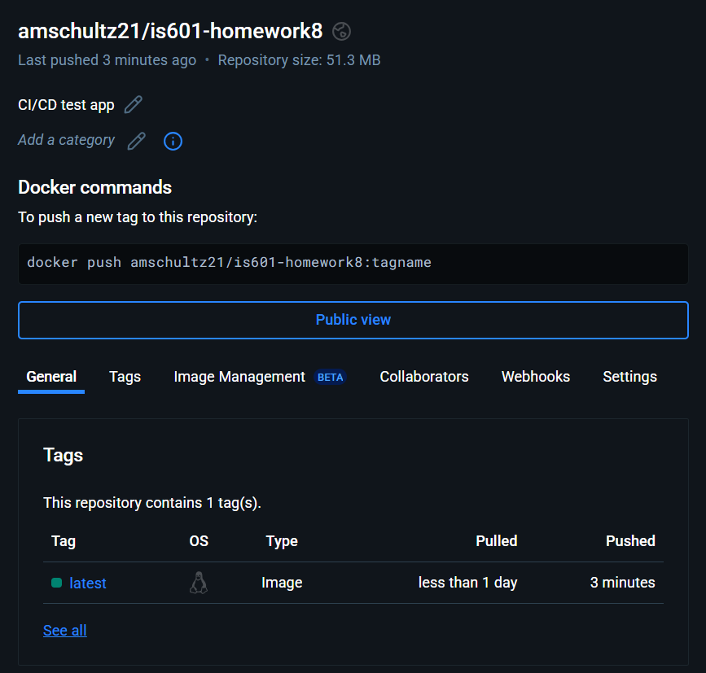

# DevOps - Automated Builds Pushing to Dockerhub

This project demonstrates a CI/CD pipeline using GitHub Actions.

## Features

- Runs Python app
- Tests with pytest
- Builds Docker image
- Pushes to DockerHub

## DockerHub Image

